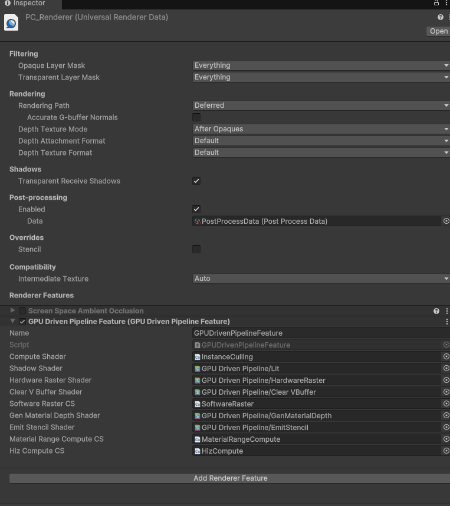
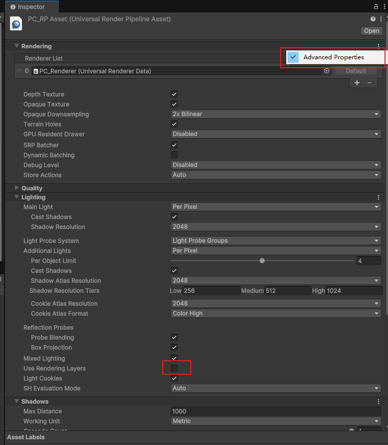
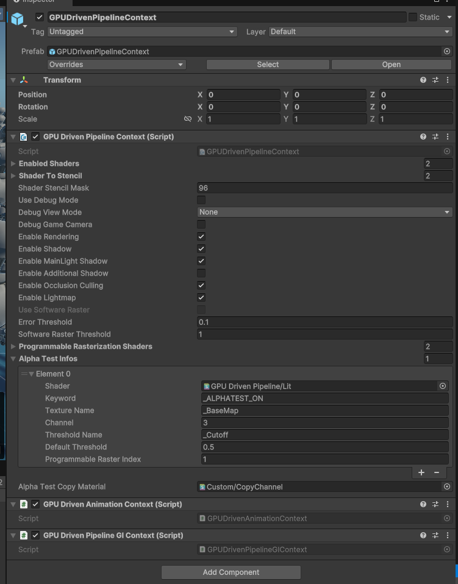
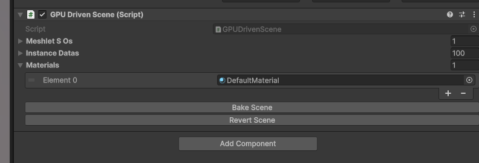

# ZEngineStudios


# ABOUT ME
>I am an independent developer primarily focused on graphics-related work. 
>I am passionate about technology and strive to bring more cool innovations. 
>Recently, I have been deeply immersed in implementing Nanite in Unity.


* * *

# Nanite Like Virtual Geometry

A Unity package inspired by Nanite, enabling massive, detailed asset rendering with seamless LOD management and virtualized geometry.

And it's a fully GPU-driven solution for Unity. I am developing this project alone in my spare time, and it excites and inspires me.

### <font color="Green">Supported Features: </font>
* Meshlet LOD and BVH node Generation

* Meshlet LOD hierarchy

* Nanite-like BVH tree

* Instance GPU frustum and occlusion culling

* BVH Node GPU frustum and occlusion culling and lod travel

* Meshlet GPU frustum and occlusion culling

* Hardware rasterizer

* Visibility buffer

* Shadow support including point light shadow and directional light shadow (CSM)

* Deferred Material

* Per Chunk Material Culling

* Single-phase rasterizer

* Support opaque object only

### <font color="red">Not Support Yet:</font>
* No software rasterier

* No two phase rasterier

* No Streaming

* No compression

* Programingable rasterier (Alpha Test)

* Skinned mesh

* Not Support Unity Terrain

* rendering layer is not supported please turn off

* Deferred shading only

* May cause issues with other render features

* Per-object technology is not supported (e.g., per-object light probe and reflection probe. Use per-pixel reflection probe and LPV instead, or pass per-object data yourself)

# Document


## Setup Guide
Using this project is very simple:

### Manually
1、Use URP. It is recommended to start with an empty Core URP project and set the Rendering Path to Deferred (this setting is usually located in "Assets/Settings/PC_Renderer.asset").

2、Modify the Pipeline Asset properties (usually found in "Assets/Settings/PC_RPAsset.asset"). Click the More button in the top right corner, open Advanced Properties, and disable the Rendering Layer feature.

3、Open PC_Renderer.asset from step 1 and add a render feature named GPU Driven Pipeline Feature.

### Automatically
Also recommended to start with an empty Core URP project. Open "Assets/GpuDrivenPipeline/Demo/Scenes/DemoScene.unity" and it will help you setup urp automatically.

Then, open DemoScene to see how it works.

## How to bake Scene
Drag Assets/GpuDrivenPipeline/Runtime/Prefabs/GPUDrivenPipelineContext.prefab into the Scene Hierarchy and configure it. The default settings should work with the default URP.

Use the configured shaders to create your scene. Then, add the GPU Driven Scene component to any GameObject and click Bake Scene to bake it into a VG scene.

If you want to continue editing the scene, click Revert Scene.

⚠️ Note: It is recommended to place all VG objects under a single root parent for better scene management and clarity.


GPUDrivenPipelineContext Settings
* **Enabled Shader**: Stores the shaders that need to be baked. GPUScene will traverse all renderers in the scene that use shaders from this list and perform baking.
⚠️ Note: The shader must be compatible with our VG. See the section below on modifying shaders for VG compatibility.

* **Shader to Stencil**: Stores the stencil values to be written by the corresponding shaders in the list. This is usually used in deferred rendering to distinguish lighting models (e.g., Lit, Simple Lit, and more).

* **Shader Stencil Mask**: Stores the stencil mask used by URP, with 96 being the default value.

* **Enable Shadow**: Toggles shadows for VG objects.

* **Enable Occlusion Culling**: Toggles OC.

* **Use Software Raster**: Currently unsupported. In Unity, 64-bit atomic operations require DX12 and DXC support. Unfortunately, Unity’s DXC support is quite poor.

* **Error Threshold**: Sets the error threshold (measured in pixels), though it is not always highly accurate. You can adjust this value to observe the effects—higher values will make lower LOD models appear more easily.

* **Software Raster Threshold**: Current just simply drop the meshlet that smaller than the value.


GPU Driven Scene as shown in the image above.

## Configure with your own shader
1、Add Render State Commands, And Add Shader Properties
```hlsl
            [HideInInspector] _ZWrite("__zw", Float) = 1.0
            [HideInInspector] _ZTest("__zt", Float) = 4.0
              ....
              ....

          Pass
          {
                Name "GBuffer"
                Tags
                {
                    "LightMode" = "UniversalGBuffer"
                }

                // Render State Commands
                ZWrite[_ZWrite]
                ZTest[_ZTest]
              ..
          }
```
2、For GBuffer pass , Change vertex pass below.
```hlsl
                #pragma multi_compile _ GPU_DRIVEN_PIPELINE
                #pragma multi_compile _ GPU_DRIVEN_PIPELINE_DEBUG // only if you need debug mode
                #pragma multi_compile _ _VBUFFER_MATERIAL_DRAW
                #include "./ShadingUtils.hlsl"
#ifdef _VBUFFER_MATERIAL_DRAW

                struct AttributesQuadCull
                {
                    uint instanceID:SV_InstanceID;
                };

                Varyings MaterialDrawVertQuadCull(AttributesQuadCull input, uint vertexID : SV_VertexID)
                {
                    Varyings output;
                    UNITY_SETUP_INSTANCE_ID(input);
                    UNITY_INITIALIZE_VERTEX_OUTPUT_STEREO(output);

                    float4 pos = GetQuadVertexPosition(vertexID);
                    float2 uv  = GetQuadTexCoord(vertexID);
                    
                    uint instanceID = UNITY_GET_INSTANCE_ID(input);

                    float2 scaleAndOffset = _MaterialTileStrideAndTileCount.xy;
                    float2 tileCount = _MaterialTileStrideAndTileCount.zw;
                    int curTileX = instanceID % int(tileCount.x);
                    int curTileY = instanceID / int(tileCount.x);
                    float2 offset = float2(curTileX, curTileY) * scaleAndOffset;


                    uint materialRange = _MaterialDepthRange.Load(int3(curTileX, curTileY, 0));
                    uint materialRangeMin = materialRange & 0x0000FFFF;
                    uint materialRangeMax = (materialRange  >> 16) & 0x0000FFFF;
                    // todo test
                    if(materialRangeMax < materialRangeMin || _MaterialID < materialRangeMin || _MaterialID > materialRangeMax)
                    {
                        // to INF
                        output.positionCS = 1000000.0f;
                        output.uv = float2(0, 0);
                        return output;
                    }

                    output.positionCS    = pos;
                    output.positionCS.xy = output.positionCS.xy * scaleAndOffset + offset;
                    output.uv   = uv * scaleAndOffset + offset;
                    
                    output.positionCS.xy = output.positionCS.xy * float2(2.0f, -2.0f) + float2(-1.0f, 1.0f); //convert to -1..1
                    
                    output.positionCS.z = EncodeMaterialID(_MaterialID);
                    return output;
                }


                Varyings CustomLitGBufferPassVertex(AttributesQuadCull input, uint vertexID : SV_VertexID)
                {
                    Varyings output = (Varyings)0;

                    return MaterialDrawVertQuadCull(input, vertexID);
                }
#endif
                
```

3、For the Fragment Shader:

```hlsl
                FragmentOutput CustomLitGBufferPassFragment(Varyings input)
                {

                    UNITY_SETUP_INSTANCE_ID(input);
                    UNITY_SETUP_STEREO_EYE_INDEX_POST_VERTEX(input);

                    // Recreate Data From VBuffer
                    #ifdef _VBUFFER_MATERIAL_DRAW
                        int meshletIndex = 0;
                        int triangleID = 0;
                        ReCreateVertOutDataFromVBuffer(input.uv, input.uv, input.positionWS, input.normalWS, input.positionCS.z, meshletIndex, triangleID);
                    #endif
                    ...
                    ...

                    // only if need debug Begin
                    #ifdef GPU_DRIVEN_PIPELINE_DEBUG
                    #if defined(GPU_DRIVEN_PIPELINE)  ||  defined(_VBUFFER_MATERIAL_DRAW)
                        uint debugIndex = 0;
                        if(_GpuDrivenPipelineDebugMode < 1.5)
                            debugIndex = meshletIndex;
                        else if(_GpuDrivenPipelineDebugMode < 2.5)
                            debugIndex = triangleID;
                        else
                            debugIndex = _MaterialID;
                        float4 debugColor[10] = {float4(1, 0, 0, 1),
                            float4(0, 1, 0, 1), float4(0, 0, 1, 1), float4(1, 1, 0, 1), float4(1, 0, 1, 1),
                            float4(0, 1, 1, 1), float4(1, 1, 1, 1), float4(0.5, 0.5, 0.5, 1), float4(0.5, 0, 0, 1), float4(0, 0.5, 0, 1)};
                        surfaceData.emission = debugColor[debugIndex % 10];
                    #endif
                    #endif
                    // only if need debug End

                    ...
                    ...
                }
```
4、for other attribute you need to interpolate from vertx, please refer to function InterpolateWithDeriv in "Assets/GpuDrivenPipeline/Runtime/Shaders/VBuffer/VBufferUtils.hlsl".

```hlsl
void ReCreateVertOutDataFromVBuffer(float2 uv, out float2 outUV, out float3 outPoitionWS, out float3 outNormalWS,
    out float outDepth, out int outMeshletIndex, out int outTriangleID)
{
#ifdef _USE_SOFT_RASTERIZATION
    uint pixelValue =  _VisBuffer.Load(int3(uv * _ScreenParams.xy, 0)).y;
#else
    uint pixelValue =  _VisBuffer.Load(int3(uv * _ScreenParams.xy, 0));
#endif
    uint cullingedNodeIndex = (pixelValue >> 7) & 0x1FFFFFF;
    uint triangeID = pixelValue & 0x7F;
    CulledNodeInfo culledNodeInfo = CulledMeshLetListForShading[cullingedNodeIndex];
    uint meshletIndex = culledNodeInfo.meshletIndex;
    NaniteMeshletNode meshlet = GetMeshletData(meshletIndex);
    InstanceData instanceData = InstanceDataBuffer[culledNodeInfo.instanceID];
    ModelData modelData = GetModelData(instanceData.modelDataIndex);
    uint modelDataIndexOffset = modelData.indicesOffset;
    uint modelDataVertexOffset = modelData.vertexOffset;
    
    float4 pt[3];
    VertexBufferLayout vertexInfo[3];
    float3 posWS[3];
    float3 normalWS[3];
    UNITY_UNROLL
    for(int i=0; i<3; ++i)
    {
        uint vertexID = triangeID * 3 + i;
        uint globalIndex = meshlet.firstIndexOffset + modelDataIndexOffset + vertexID;
        uint globalVertexIndex = indicesBuffer[globalIndex] + modelDataVertexOffset;
        vertexInfo[i] = vertexBuffer[globalVertexIndex];
        posWS[i] = mul(instanceData.worldTransfrom,  float4(vertexInfo[i].position, 1.0)).xyz;
        normalWS[i] = normalize(mul(instanceData.worldTransfrom, vertexInfo[i].normal).xyz);
        pt[i] = mul(UNITY_MATRIX_VP, float4(posWS[i], 1.0));
        pt[i] /= pt[i].w;
    }

    float2 winSize = _ScreenParams.xy;

#if UNITY_UV_STARTS_AT_TOP
    uv.y = 1.0f - uv.y;
#endif

    float2 pixelNdc = uv * 2.0f - 1.0f;
    
    BarycentricDeriv bary = CalcFullBary(pt[0], pt[1], pt[2], pixelNdc, winSize);
    // todo add your own attribute like below
    outUV = InterpolateWithDeriv(bary, vertexInfo[0].uv, vertexInfo[1].uv, vertexInfo[2].uv);
    outPoitionWS = InterpolateWithDeriv(bary, posWS[0], posWS[1], posWS[2]);
    outNormalWS = normalize(InterpolateWithDeriv(bary, normalWS[0], normalWS[1], normalWS[2]));
    outDepth = InterpolateWithDeriv(bary, pt[0].z, pt[1].z, pt[2].z).x;
    outMeshletIndex = meshletIndex;
    outTriangleID = triangeID;
}

```
4、for shadow pass
```hlsl
              #include "./ShadingUtils.hlsl"
              #pragma multi_compile _ GPU_DRIVEN_PIPELINE
              ...
              ...

              float4 GetShadowPositionHClipGPUDriven(Attributes input)
              {
                  // todo
                  // float3 positionWS = TransformObjectToWorld(input.positionOS.xyz);
                  // float3 normalWS = TransformObjectToWorldNormal(input.normalOS);
                  float3 positionWS = input.positionOS.xyz;
                  float3 normalWS = input.normalOS;
                  
              #if _CASTING_PUNCTUAL_LIGHT_SHADOW
                  float3 lightDirectionWS = normalize(_LightPosition - positionWS);
              #else
                  float3 lightDirectionWS = _LightDirection;
              #endif

                  float4 positionCS = TransformWorldToHClip(ApplyShadowBias(positionWS, normalWS, lightDirectionWS));

              #if UNITY_REVERSED_Z
                  positionCS.z = min(positionCS.z, UNITY_NEAR_CLIP_VALUE);
              #else
                  positionCS.z = max(positionCS.z, UNITY_NEAR_CLIP_VALUE);
              #endif

                  return positionCS;
              }   

              Varyings CustomShadowPassVertex(Attributes input, uint vertexID : SV_VertexID)
              {
                  Varyings output;
                  UNITY_SETUP_INSTANCE_ID(input);
                  UNITY_TRANSFER_INSTANCE_ID(input, output);

                  #ifdef GPU_DRIVEN_PIPELINE
                      uint instanceID = UNITY_GET_INSTANCE_ID(input);
                      uint meshletIndex = 0;
                      uint nodeOffset = 0;
                      float3 tangentWS = 0;
                      input.positionOS.xyz = UpdateMeshlet(instanceID, vertexID, input.normalOS, input.texcoord, meshletIndex, nodeOffset, tangentWS);
                      output.positionCS = GetShadowPositionHClipGPUDriven(input);
                  #else
                      output.positionCS = GetShadowPositionHClip(input);
                  #endif

                  
                  #if defined(_ALPHATEST_ON)
                  output.uv = TRANSFORM_TEX(input.texcoord, _BaseMap);
                  #endif
                      
                  return output;
              }
```

## GC Free
To avoid making intrusive modifications to URP, I use reflection to call certain functions and properties during the shadow rendering phase of VG.

To enable a GC-free function call approach, I use the macro GPU_DRIVEN_PIPELINE_NO_GC to differentiate between the GC-free and non-GC-free versions.

You can manually add GPU_DRIVEN_PIPELINE_NO_GC to ProjectSettings -> Player -> Scripting Define Symbols to switch to the GC-free version. Additionally, copy the URP package to your local project and modify any private or internal properties and methods causing compilation errors by changing them to public.

## Technical Details

### Meshlet Generation
The meshlets of Virtual Geometry are generated using meshoptimizer. Each LOD level reduces the triangle count by half, similar to Nanite. Edge locking is applied only at the boundaries between adjacent levels to ensure smooth transitions without sudden visual artifacts.

Processing Pipeline:
* **Initial Simplification**: The algorithm first attempts to simplify the mesh using meshopt_simplify, which preserves boundaries and topology.
If the triangle count can be reduced to 50%, the simplification is applied.
* **Fallback Simplification**: If the triangle count cannot be reduced sufficiently, meshopt_simplifySloppy is used instead.
This method does not guarantee boundary and topology preservation but ensures the target triangle reduction is achieved.
As a result, at the lowest LOD levels, seams and isolated mesh elements may disappear.
* **Potential Optimizations**:
The algorithm still has much room for improvement. The author of meshoptimizer (zeux) provides an API that allows explicitly specifying edges that need to be locked. This can be used to ensure better boundary preservation between adjacent LOD levels. Using this API should result in a higher-quality simplification (TODO).

The current version of BVH traversal is similar to the terrain LOD traversal used in Far Cry 5. I dispatch a compute shader with 1024 threads and traverse the LODs, swapping at each level.

### About BVH Travel
This may not be the most efficient approach, and the current version does not include multi-view processing (though implementing it should not be too difficult). As a result, the CPU overhead for shadows is relatively high.

### About Mobile
I have not tested this on mobile devices. However, from a technical standpoint, since software rasterization is not used, my VG implementation should be able to run on mobile devices.

That said, as everyone knows, Nanite has not been optimized for mobile either. Given the bandwidth limitations on mobile devices, the performance may not be ideal.

### About Programmable Rasterization
Regarding programmable rasterization (specifically alpha testing), I don't see any major technical challenges. However, I lack suitable engineering implementations as references.

I might consider implementing a simplified version of alpha testing, such as reading a texture based on UV coordinates during rasterization and applying alpha testing accordingly.

In the future, I may also work on integrating GPU Skinning with meshlets.

## Contact Me

If you encounter any issues or have any suggestions while using this project, please feel free to email me.

If you encounter a bug, please include a minimal reproducible demo, which should contain:
Code
Minimal reproducible scene
URP version
Unity version
Description of the issue and error stack trace


