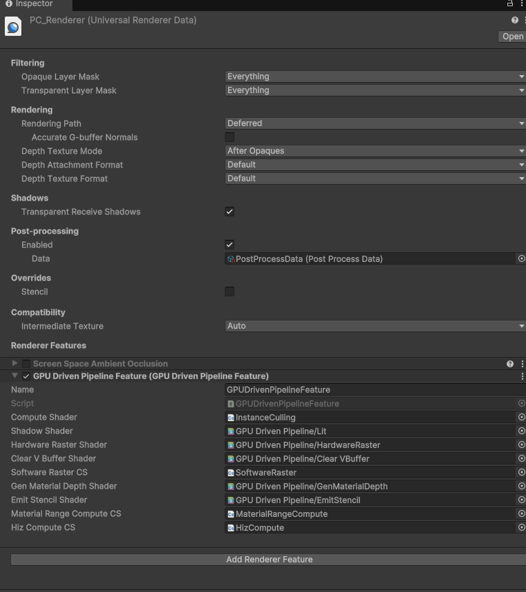
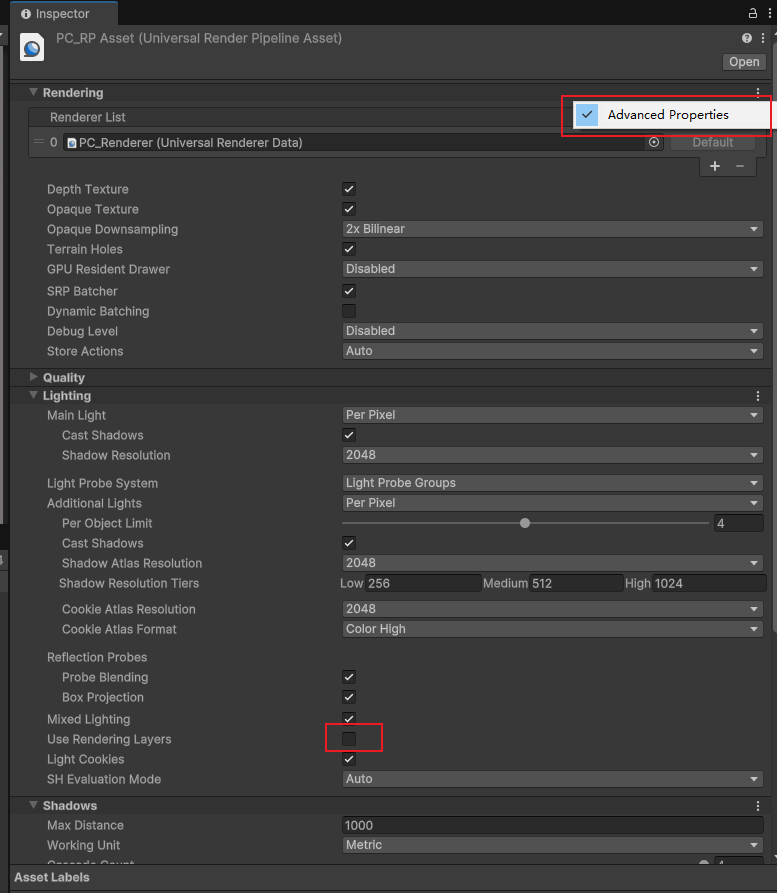
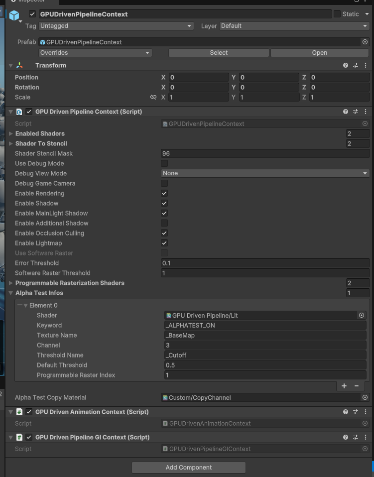
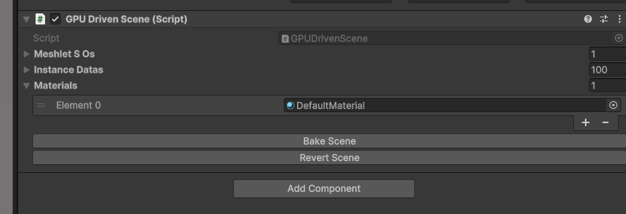

# ZEngineStudios


# ABOUT ME
>I am an independent developer primarily focused on graphics-related work. 
>I am passionate about technology and strive to bring more cool innovations. 
>Recently, I have been deeply immersed in implementing Nanite in Unity.


# Nanite Like Virtual Geometry

A Unity package inspired by Nanite, enabling massive, detailed asset rendering with seamless LOD management and virtualized geometry.

And its a full GPU driven solution For Unity. I am developing this project alone in my spare time, and it excites and inspires me.

### <font color="Green">Support Feature: </font>
Meshlet LOD and BVH node Generation

Meshlet LOD hierarchy

Nanite like BVH tree

Instance GPU frustum and occlusion culling

BVH Node GPU frustum and occlusion culling and lod travel

Meshlet GPU frustum and occlusion culling

Hardware rasterier

Visibility buffer

Shadow support including point light shadow and directional light shadow (CSM)

Deferred Material

Per Chunk Material Culling

single phase rasterier

support opaque object only

### <font color="red">Not Support Yet:</font>
No software rasterier

No two phase rasterier

No Streaming

No compression

Programingable rasterier (Alpha Test)

Skinned mesh

Not Support Unity Terrain

rendering layer is not supported please turn off

Deferred shading only

may casue issues with other render feature

per object technology is not supported (ex.per object light probe and reflection probe, use per pixel reflection probe and LPV instand or pass per object data by yourself)

## Document


### Setup Guide
Using this project is very simple:

#### Manually
1、Use URP. It is recommended to start with an empty Core URP project and set the Rendering Path to Deferred (this setting is usually located in "Assets/Settings/PC_Renderer.asset").

2、Modify the Pipeline Asset properties (usually found in "Assets/Settings/PC_RPAsset.asset"). Click the More button in the top right corner, open Advanced Properties, and disable the Rendering Layer feature.

3、Open PC_Renderer.asset from step 1 and add a render feature named GPU Driven Pipeline Feature.

#### Automatically
Also recommended to start with an empty Core URP project. Open "Assets/GpuDrivenPipeline/Demo/Scenes/DemoScene.unity" and it will help you setup urp automatically.

And open DemoScene to see How it works.

### How to bake Scene
Drag Assets/GpuDrivenPipeline/Runtime/Prefabs/GPUDrivenPipelineContext.prefab into the Scene Hierarchy and configure it. The default settings should work with the default URP.

Use the configured shaders to create your scene. Then, add the GPU Driven Scene component to any GameObject and click Bake Scene to bake it into a VG scene.

If you want to continue editing the scene, click Revert Scene.

⚠️ Note: It is recommended to place all VG objects under a single root parent for better scene management and clarity.


GPUDrivenPipelineContext Settings
* **Enabled Shader**: Stores the shaders that need to be baked. GPUScene will traverse all renderers in the scene that use shaders from this list and perform baking.
⚠️ Note: The shader must be compatible with our VG. See the section below on modifying shaders for VG compatibility.

* **Shader to Stencil**: Stores the stencil values to be written by the corresponding shaders in the list. This is usually used in deferred rendering to distinguish lighting models (e.g., Lit, Simple Lit, and more).

* **Shader Stencil Mask**: Stores the stencil mask used by URP, with 96 being the default value.

* **Enable Shadow**: Toggles shadows for VG objects.

* **Enable Occlusion Culling**: Toggles OC.

* **Use Software Raster**: Currently unsupported. In Unity, 64-bit atomic operations require DX12 and DXC support. Unfortunately, Unity’s DXC support is quite poor.

* **Error Threshold**: Sets the error threshold (measured in pixels), though it is not always highly accurate. You can adjust this value to observe the effects—higher values will make lower LOD models appear more easily.

* **Software Raster Threshold**: Current just simply drop the meshlet that smaller than the value.


GPU Driven Scene as shown in the image above.

```js
// Javascript code with syntax highlighting.
var fun = function lang(l) {
  dateformat.i18n = require('./lang/' + l)
  return true;
}
```

```ruby
# Ruby code with syntax highlighting
GitHubPages::Dependencies.gems.each do |gem, version|
  s.add_dependency(gem, "= #{version}")
end
```

#### Header 4

*   This is an unordered list following a header.
*   This is an unordered list following a header.
*   This is an unordered list following a header.

##### Header 5

1.  This is an ordered list following a header.
2.  This is an ordered list following a header.
3.  This is an ordered list following a header.

###### Header 6

| head1        | head two          | three |
|:-------------|:------------------|:------|
| ok           | good swedish fish | nice  |
| out of stock | good and plenty   | nice  |
| ok           | good `oreos`      | hmm   |
| ok           | good `zoute` drop | yumm  |

### There's a horizontal rule below this.

* * *

### Here is an unordered list:

*   Item foo
*   Item bar
*   Item baz
*   Item zip

### And an ordered list:

1.  Item one
1.  Item two
1.  Item three
1.  Item four

### And a nested list:

- level 1 item
  - level 2 item
  - level 2 item
    - level 3 item
    - level 3 item
- level 1 item
  - level 2 item
  - level 2 item
  - level 2 item
- level 1 item
  - level 2 item
  - level 2 item
- level 1 item

### Small image


### Large image


### Definition lists can be used with HTML syntax.

<dl>
<dt>Name</dt>
<dd>Godzilla</dd>
<dt>Born</dt>
<dd>1952</dd>
<dt>Birthplace</dt>
<dd>Japan</dd>
<dt>Color</dt>
<dd>Green</dd>
</dl>

```
Long, single-line code blocks should not wrap. They should horizontally scroll if they are too long. This line should be long enough to demonstrate this.
```

```
The final element.
```
